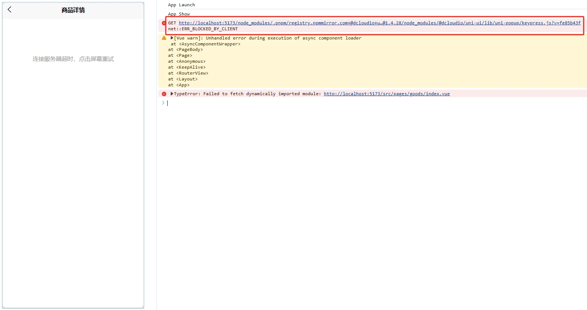
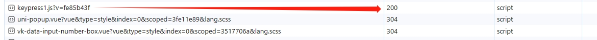

# H5 端 引用 `uni-popup` 组件异常

## 问题复现

页面代码引用了一个第三方的 `sku` 组件及 `uni-popup` 组件，在微信小程序端正常使用，无异常报错，而切换为 H5 端（Chrome 浏览器）运行时报错误了。



```Vue
<!-- 商品详情页面主要代码 -->
<template>
	<vk-data-goods-sku-popup
		ref="skuPopup"
		v-model="isShowSku"
		border-radius="20"
		:localdata="goodsInfo"
		:mode="mode"
		:actived-style="{
			color: '#27BA9B',
			borderColor: '#27BA9B',
			backgroundColor: '#E9F8F5',
		}"
		add-cart-background-color="#ffa868"
		buy-now-background-color="#27ba9b"
		@add-cart="addCart"
		@buy-now="buyNow"
	/>

  ...

	<scroll-view enable-back-to-top scroll-y class="viewport">
		...
	</scroll-view>

	...

	<!-- uni-ui 弹出层 -->
	<uni-popup ref="popup" type="bottom" background-color="#fff">
		...
	</uni-popup>
</template>
```

进到报错的文件目录下，查看 `keypress.js` 这个文件源码后发现并没有什么特别的，只是实现了绑定键盘事件。

```javascript
// keypress.js 源码
// #ifdef H5
export default {
  name: "Keypress",
  props: {
    disable: {
      type: Boolean,
      default: false,
    },
  },
  mounted() {
    const keyNames = {
      esc: ["Esc", "Escape"],
      tab: "Tab",
      enter: "Enter",
      space: [" ", "Spacebar"],
      up: ["Up", "ArrowUp"],
      left: ["Left", "ArrowLeft"],
      right: ["Right", "ArrowRight"],
      down: ["Down", "ArrowDown"],
      delete: ["Backspace", "Delete", "Del"],
    };
    const listener = ($event) => {
      if (this.disable) {
        return;
      }
      const keyName = Object.keys(keyNames).find((key) => {
        const keyName = $event.key;
        const value = keyNames[key];
        return value === keyName || (Array.isArray(value) && value.includes(keyName));
      });
      if (keyName) {
        // 避免和其他按键事件冲突
        setTimeout(() => {
          this.$emit(keyName, {});
        }, 0);
      }
    };
    document.addEventListener("keyup", listener);
    // this.$once('hook:beforeDestroy', () => {
    //   document.removeEventListener('keyup', listener)
    // })
  },
  render: () => {},
};
// #endif
```

## 分析与解决

结合截图的异常信息及 `net::ERR_BLOCKED_BY_CLIENT` 发现在引用 `uni-popup` 组件时因为 `uni-popup.vue` 文件里 `import keypress from './keypress.js'` 这行代码导入的 `keypress.js` 文件被浏览器拦截禁止加载了，导致商品详情页面不能正常使用 `uni-popup` 组件，尝试把 `keypress.js` 文件名改为 `keypress1.js`，
重新运行发现正常了:disappointed_relieved:。



虽然解决了，但通过改依赖库的源码这种方式肯定是不可取的。既然是浏览器拦截了 `keypress.js` 文件，咦。。。，拦截，广告拦截，难不成是广告拦截插件造成的:joy:。撤销源码的修改，然后对当月开发环境的地址禁用使用广告拦截器，刷新后运行正常。:sweat_smile::sweat_smile::sweat_smile:

> 使用的广告拦截插件名：uBlock Origin
