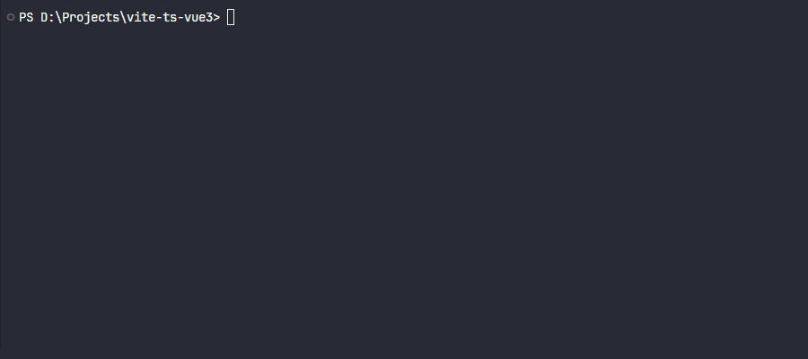
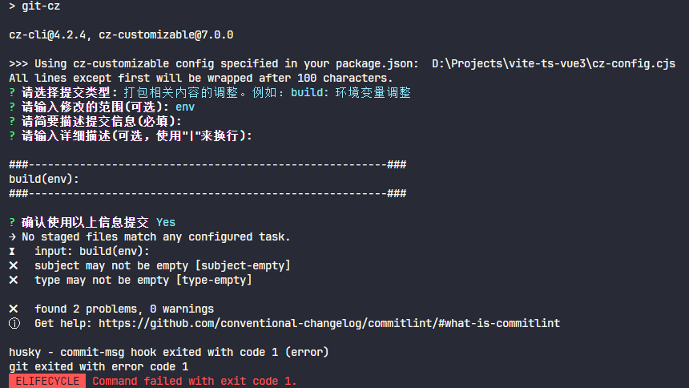

# Vue 3 + TypeScript + Vite

This template should help get you started developing with Vue 3 and TypeScript in Vite. The template uses Vue 3 `<script setup>` SFCs, check out the [script setup docs](https://v3.vuejs.org/api/sfc-script-setup.html#sfc-script-setup) to learn more.

## Recommended IDE Setup

- [VS Code](https://code.visualstudio.com/) + [Volar](https://marketplace.visualstudio.com/items?itemName=Vue.volar) (and disable Vetur) + [TypeScript Vue Plugin (Volar)](https://marketplace.visualstudio.com/items?itemName=Vue.vscode-typescript-vue-plugin).

## Type Support For `.vue` Imports in TS

TypeScript cannot handle type information for `.vue` imports by default, so we replace the `tsc` CLI with `vue-tsc` for type checking. In editors, we need [TypeScript Vue Plugin (Volar)](https://marketplace.visualstudio.com/items?itemName=Vue.vscode-typescript-vue-plugin) to make the TypeScript language service aware of `.vue` types.

If the standalone TypeScript plugin doesn't feel fast enough to you, Volar has also implemented a [Take Over Mode](https://github.com/johnsoncodehk/volar/discussions/471#discussioncomment-1361669) that is more performant. You can enable it by the following steps:

1. Disable the built-in TypeScript Extension
   1. Run `Extensions: Show Built-in Extensions` from VSCode's command palette
   2. Find `TypeScript and JavaScript Language Features`, right click and select `Disable (Workspace)`
2. Reload the VSCode window by running `Developer: Reload Window` from the command palette.

## 软件架构

1. vue: ^3.3.4
2. vue-router: ^4.2.4
3. pinia: ^2.1.6
4. axios: ^1.5.0
5. vueuse: ^10.4.1
6. sass: ^1.66.1
7. nodejs: v18.13.0
8. typescript: ^5.0.2
9. vite: ^4.4.5
10. eslint: ^8.48.0
11. prettier: ^3.0.3
12. commitizen: 4.2.4
    > 超过此版本的其他版本会造成自定义 scope 没法正常输入，可以在 [No scope question error](https://github.com/leoforfree/cz-customizable/issues/215)、[Fix custom scopes - Add askAnswered to true](https://github.com/leoforfree/cz-customizable/pull/214) 这个两个 issue 上了解此问题
13. husky: ^8.0.3

## 安装

`yarn install` 或 `pnpm instal` 或 `npm install`

> 使用 `npm` 如出现下载不了依赖或是比较慢的时候，可以切换为淘宝镜像
> `npm config set registry http://registry.npm.taobao.org/`

## 使用说明

1. 安装完成后会自动执行 `package.json` 里的 `prepare` 脚本，此脚本是生成 `.husky` 的文件夹
2. 执行 `package.json` 里的 `hooks` 脚本，此脚本会在 `.husky` 目录下生成一个 `pre-commit` 脚本文件
3. 执行 `package.json` 里的 `commit-msg` 脚本，此脚本会在 `.husky` 目录下生成一个 `commit-msg` 脚本文件，当提交代码时会触发校验提交信息是否符合设定的规范
4. 执行 `package.json` 里的 `dev` 脚本，启动本地的开发环境

## 技术特点

### 使用 `Vite` 搭建项目

- 使用 `vite-cli` 命令

```node
# pnpm
pnpm create vite

# npm
npm init vite@latest

# yarn
yarn create vite
```

- 输入项目名

```node
? Project name: » vite-project
```

- 选择框架（vue）

```node
? Select a framework: » - Use arrow-keys. Return to submit.
```

- 选择变体（Typescript）

```node
? Select a variant: » - Use arrow-keys. Return to submit.
```

- 启动项目

```node
cd 项目名 && pnpm install && pnpm run dev
```

### 在项目中集成 `typescript`

- 安装 `Typescript` 环境下能正常使用的 `Node.js API` 依赖

```node
pnpm i @types/node -D
```

- 修改 `tsconfig.json`

```javascript
{
	compilerOptions: {
		target: 'ES2020',
		useDefineForClassFields: true,
		module: 'ESNext',
		lib: ['ES2020', 'DOM', 'DOM.Iterable'],
		skipLibCheck: true,

		/* Bundler mode */
		moduleResolution: 'node',
		allowImportingTsExtensions: true,
		resolveJsonModule: true,
		isolatedModules: true,
		noEmit: true,
		jsx: 'preserve',

		/* Linting */
		strict: true,
		noUnusedLocals: true,
		noUnusedParameters: true,
		noFallthroughCasesInSwitch: true,

		baseUrl: './',
		paths: {
				'@': ['src'],
				'@/*': ['src/*'],
		},
	},
	include: ['src/**/*.ts', 'src/**/*.d.ts', 'src/**/*.tsx', 'src/**/*.vue'],
	references: [{ path: './tsconfig.node.json' }],
}
```

- 修改 `vite.config.ts`

```typescript
import { defineConfig, loadEnv } from "vite";
import vue from "@vitejs/plugin-vue";
import * as path from "path";
import viteCompression from "vite-plugin-compression";

// https://vitejs.dev/config/
export default (option: any) => {
  const { mode } = option;
  const env: any = loadEnv(mode, process.cwd());

  return defineConfig({
    plugins: [
      vue(),
      viteCompression({
        verbose: true,
        disable: false,
        threshold: 10240,
        algorithm: "gzip",
        ext: ".gz",
        deleteOriginFile: false,
      }),
    ],
    resolve: {
      // 设置别名
      alias: {
        "@": path.resolve(__dirname, "src"),
      },
    },
    server: {
      // 启动端口
      port: 8080,
      open: true,
      // 设置代理
      proxy: {
        "/api": {
          target: env.VITE_APP_API_URL,
          changeOrigin: true,
          rewrite: (path: string) => path.replace(/^\/api/, ""),
        },
      },
    },
  });
};
```

### 在项目中集成 `vue-router` 和 `pinia`

- 安装

```node
pnpm i vue-router pinia --save
```

- 新建 `src/router` 目录并在其下面创建 `index.ts`，导出 `router`

```typescript
import { createRouter, createWebHistory, RouteRecordRaw } from "vue-router";

const routes: Array<RouteRecordRaw> = [
  {
    path: "/login",
    name: "Login",
    meta: {
      title: "登录",
      keepAlive: true,
      requireAuth: false,
    },
    component: () => import("@/views/login/index.vue"),
  },
  {
    path: "/",
    name: "Home",
    meta: {
      title: "首页",
      keepAlive: true,
      requireAuth: true,
    },
    component: () => import("@/views/home/index.vue"),
  },
];

const router = createRouter({
  history: createWebHistory(),
  routes,
});

export default router;
```

- 新建 `src/store` 目录并在其下面创建 `index.ts`，导出 `store`

```typescript
import { createPinia } from "pinia";

const store = createPinia();

export default store;
```

- 定义模块，新建 `src/store/modules` 目录并在其下面创建 `user.ts`

```typescript
import { defineStore } from "pinia";

export const useUserStore = defineStore({
  // id 必填，且需要唯一
  id: "user",
  state: () => {
    return {
      name: "Administrator",
    };
  },
  actions: {
    updateName(name: string): void {
      this.name = name;
    },
  },
});
```

- 在 `main.ts` 中引入 `router` 和 `store` 并使用

```typescript
import { createApp } from "vue";
import "@/style.css";
import App from "@/App.vue";
import router from "@/router";
import store from "@/store";

// 创建 vue 实例
const app = createApp(App);

// 挂载路由
app.use(router);

// 挂载 pinia
app.use(store);

app.mount("#app");
```

- 修改 `App.vue`

```vue
<template>
  <RouterView />
</template>
```

### 在项目中集成 `axios`

- 安装

```node
pnpm i axios --save
```

- 新建 `src/api` 目录并在其下面创建 `service.ts`

```typescript
import axios, { AxiosInstance, AxiosRequestConfig, AxiosRequestHeaders, AxiosResponse, AxiosError } from "axios";
import log from "@/utils/log";

/**
 * INFO: 类型“(config: AxiosRequestConfig) => AxiosRequestConfig<any>”的参数不能赋给类型“(value: InternalAxiosRequestConfig<any>) => InternalAxiosRequestConfig<any> | Promise<InternalAxiosRequestConfig<any>>”的参数.
 */
interface AdaptAxiosRequestConfig extends AxiosRequestConfig {
  headers: AxiosRequestHeaders;
}

const baseRequestConfig: AxiosRequestConfig = {
  baseURL: import.meta.env.VITE_APP_API_URL,
  timeout: 15000,
};

// Request interceptors
const service: AxiosInstance = axios.create(baseRequestConfig);

const err = (err: AxiosError): Promise<AxiosError> => {
  if (err.response?.status === 401 || err.response?.status === 504) {
    // INFO: do something, 可清除登录信息及重定向到登录页
  }

  return Promise.reject(err);
};

service.interceptors.request.use((config: AdaptAxiosRequestConfig) => {
  // do something
  if (config.headers) {
    config.headers["Access-Token"] = "Access-Token";
  }

  return config;
}, err);

const handleError = (res: AxiosResponse<any, any>) => {
  // Print to console
  if (import.meta.env.MODE === "development") {
    log.capsule("Error", "UI");
    log.error(res);
  }
  return Promise.reject(res);
};

service.interceptors.response.use((res: AxiosResponse) => {
  // No code will be processed
  if (res.data.code === undefined) {
    return res.data;
  }

  switch (res.data.code) {
    case 0:
      return res.data.data;
    default:
      handleError(res);
      throw new Error();
  }
}, err);

export default service;
```

- 定义模块，新建 `src/api/modules` 目录并在其下面创建 `auth` 目录，按功能创建对应的目录，并在此目录下创建 `index.ts` 和 `types.ts` 两个文件

```typescript
// index.ts
import service from "@/api/service";
import { LoginReq } from "./types";

/**
 * 登录
 */
export function login(data: LoginReq): any {
  return service({
    url: "/login",
    method: "post",
    data,
  });
}

// types.ts
interface LoginReq {
  userName: string;
  userPassword: string;
}

interface LoginRes {
  token: string;
}

export type { LoginReq, LoginRes };
```

### 在项目中集成 `scss`

- 安装

```node
pnpm i sass sass-loader -D
```

- 在 `.vue` 文件中使用

```vue
<template>
  <div class="container">home</div>
</template>

<style lang="scss">
$bgColor: #fff;

.container {
  background-color: $bgColor;
}
</style>
```

### 在项目中集成 `vueuse`

- 安装

```node
pnpm i @vueuse/core --save
```

- 使用方式具体看官网文档 [VueUse](https://vueuse.org/guide/)

### 在项目中集成 `prettier` 和 `eslint` 以规范代码编写习惯

- 安装 `prettier`

```node
pnpm i prettier -D
```

- 创建配置文件：`.prettierrc.cjs`
  > 在 `package.json` 中指定 `"type": "module"` 时得使用 `.prettierrc.cjs`

```cjs
module.exports = {
  // 达到 120 字符换行
  printWidth: 120,
  // 指定每个缩进级别的空格数: 2
  tabWidth: 2,
  // 用制表符而不是空格缩进行
  useTabs: true,
  // 行尾需要有分号
  semi: true,
  // 使用单引号而不是双引号
  singleQuote: true,
  // 仅在需要时在对象属性周围添加引号
  quoteProps: "as-needed",
  // 在 JSX 中使用单引号而不是双引号
  jsxSingleQuote: false,
  // 尽可能在尾随逗号（包括 函数参数和调用）
  trailingComma: "all",
  // 对象字面量中括号之间的空格，如 { foo: bar }
  bracketSpacing: true,
  // 将多行 HTML（HTML、JSX、Vue、Angular）元素的 > 放在最后一行的末尾，而不是单独放在下一行（不适用于自关闭元素）
  bracketSameLine: false,
  // 在唯一的箭头函数参数周围包含括号，如 (x) => x
  arrowParens: "always",
  // 使用默认的折行标准
  proseWrap: "preserve",
  // 指定 HTML、Vue、Angular 和 Handlebars 的全局空白敏感度，遵守 CSS display 属性的默认值
  htmlWhitespaceSensitivity: "css",
  // 换行符使用 lf
  endOfLine: "lf",
};
```

- 创建忽略文件：`.prettierignore`

```ignore
/src/assets
```

- 安装 `eslint`

```node
pnpm i eslint eslint-config-prettier eslint-plugin-prettier eslint-plugin-vue @typescript-eslint/parser @typescript-eslint/eslint-plugin -D
```

- 创建配置文件：`.eslintrc.cjs`
  > 在 `package.json` 中指定 `"type": "module"` 时得使用 `.eslintrc.cjs`

```cjs
module.exports = {
  parser: "vue-eslint-parser",
  parserOptions: {
    parser: "@typescript-eslint/parser",
    ecmaVersion: 2020,
    sourceType: "module",
    ecmaFeatures: {
      jsx: true,
    },
  },
  extends: [
    "plugin:vue/vue3-recommended",
    "plugin:@typescript-eslint/recommended",
    "prettier",
    "plugin:prettier/recommended",
  ],
  rules: {
    // override/add rules settings here
    "vue/multi-word-component-names": "off",
    "@typescript-eslint/no-explicit-any": ["off"],
  },
};
```

- 创建忽略文件：`.eslintignore`

```ignore
node_modules/
dist/
index.html
```

- 修改 `package.json`

```node
{
	...
	"scripts": {
		...
		"lint": "eslint src --fix --ext .ts,.tsx,.vue",
		"prettier": "prettier --write \"src/**/*.{vue,ts,tsx}\"",
	}
	...
}
```

### 规范化 `git` 提交信息

- 安装 `commitizen`

```node
pnpm i commitizen cz-conventional-changelog @commitlint/config-conventional @commitlint/cli commitlint-config-cz cz-customizable -D
```

- 修改 `package.json`

```node
{
	...
	"scripts": {
		...
		"commit": "git-cz"
	},
	...
	"config": {
		"commitizen": {
			"path": "node_modules/cz-customizable"
		},
		"cz-customizable": {
			"config": "./cz-config.cjs"
		}
	}
  ...
}
```

- 创建配置文件：`cz-config.cjs`
  > 在 `package.json` 中指定 `"type": "module"` 时得使用 `cz-config.cjs`

```cjs
module.exports = {
  types: [
    { value: "feat", name: "Features -- feat: 新增客户管理模块" },
    { value: "fix", name: "Bug Fixes -- fix: 修复登录退出未请求服务端接口" },
    { value: "perf", name: "Performance Improvements -- perf: 提升性能、体验" },
    { value: "revert", name: "Reverts -- revert: 回滚到上一个版本" },
    { value: "docs", name: "Documentation -- docs: 操作说明文档完善补充协议" },
    { value: "style", name: "Styles -- style: 登录页面背景颜色调整至灰白色" },
    { value: "refactor", name: "Code Refactoring -- refactor: 重构数据列表，优化性能" },
    { value: "test", name: "Tests -- test: 登录页面测试环境调试" },
    { value: "build", name: "Build System -- build: 环境变量调整，增加依赖" },
    { value: "ci", name: "Continuous Integration -- ci: 修改k8s, docker的配置信息" },
  ],
  messages: {
    type: "选择提交类型:",
    customScope: "请输入此更改的范围(可选):",
    subject: "请简要描述提交信息(必填):",
    body: '请输入详细描述(可选，使用"|"换行):',
    breaking: '请列举相关重大变更信息(可选，使用"|"换行)',
    footer: "请列举关联issue(可选，例如：#1，#5)",
    confirmCommit: "确认使用以上信息提交",
  },
  allowCustomScopes: true,
  allowBreakingChanges: ["feat", "fix"],
  skipQuestions: [],
  subjectLimit: 100,
};
```

- 执行 `pnpm commit` 查看界面效果

  

- 创建配置文件：`commitlint.config.cjs`
  > 在 `package.json` 中指定 `"type": "module"` 时得使用 `commitlint.config.cjs`

```cjs
module.exports = {
  extends: ["@commitlint/config-conventional", "cz"],
  rules: {
    "type-enum": [
      2,
      "always",
      [
        "feat", // Features -- feat: 新增客户管理模块
        "fix", // Bug Fixes -- fix: 修复登录退出未请求服务端接口
        "perf", // Performance Improvements -- perf: 提升性能、体验
        "revert", // Reverts -- revert: 回滚到上一个版本
        "docs", // Documentation -- docs: 操作说明文档完善补充协议
        "style", // Styles -- style: 登录页面背景颜色调整至灰白色
        "refactor", // Code Refactoring -- refactor: 重构数据列表，优化性能
        "test", // Tests -- test: 登录页面测试环境调试
        "build", // Build System -- build: 环境变量调整，增加依赖
        "ci", // Continuous Integration -- ci: 修改k8s, docker的配置信息
      ],
    ],
    // type 格式固定小写
    "type-case": [2, "always", "lower-case"],
    // type 不能为空
    "type-empty": [2, "never"],
    // scope 格式不启用
    "scope-case": [0],
    // scope 修改范围不能为空
    "scope-empty": [0],
    // subject 不能为空
    "subject-empty": [2, "never"],
    // subject 以什么为结束标志，不启用
    "subject-full-stop": [0],
    // subject 格式，不启用
    "subject-case": [0],
    // 最大长度 100 字符
    "header-max-length": [0, "always", 100],
  },
};
```

- 安装 `husky`

```node
pnpm i husky lint-staged -D
```

- 修改 `package.json`

```node
{
	...
	"scripts": {
		...
		"prepare": "husky install",
		"hooks": "husky add .husky/pre-commit \"npx --no-install lint-staged\"",
		"commit-msg": "husky add .husky/commit-msg \"npx --no-install commitlint --edit \"$1\"\"",
	},
  ...
	"lint-staged": {
		"*.{js,ts,vue}": [
			"pnpm run lint",
			"pnpm run prettier"
		]
	}
}
```

- 执行脚本 `pnpm hooks` 或 `npx husky add .husky/pre-commit "npx --no-install lint-staged"`

- 执行脚本 `pnpm commit-msg` 或 `npx husky add .husky/commit-msg 'npx --no-install commitlint --edit "$1"'`

- 执行脚本 `pnpm commit` 或 `git commit -m "message"` 的效果

  

### 集成 `conventional-changelog` 自动生成版本说明

- 安装 `conventional-changelog-cli`

```node
pnpm i conventional-changelog-cli -D
```

- 修改 `package.json`

```node
{
	...
	"scripts": {
		...
		"changelog": "conventional-changelog -p angular -i CHANGELOG.md -s && git add CHANGELOG.md"
	},
	...
}
```

- 执行 `pnpm changelog` 后在根目录下生成 `CHANGELOG.md` 文件
