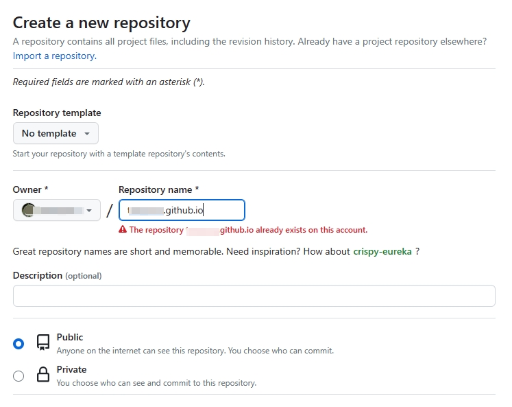
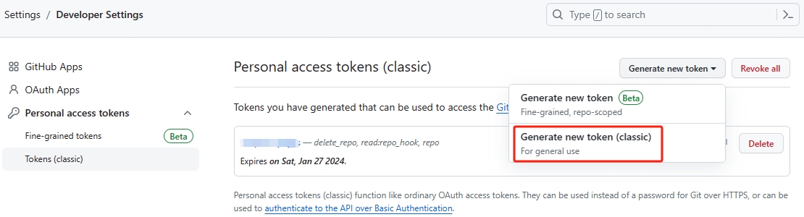
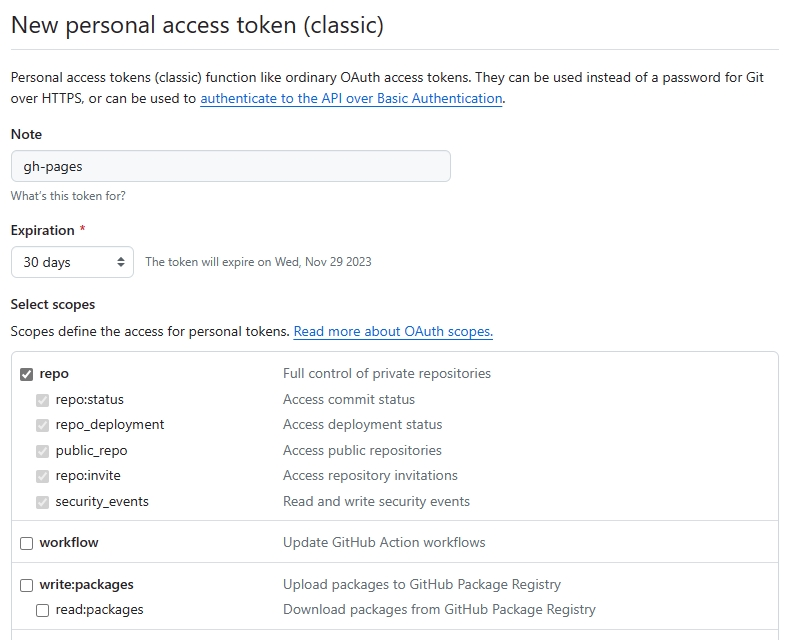
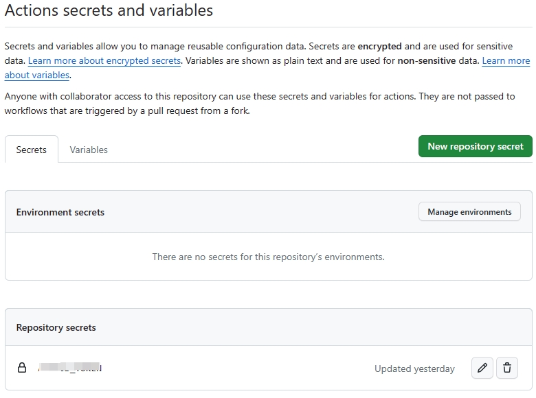
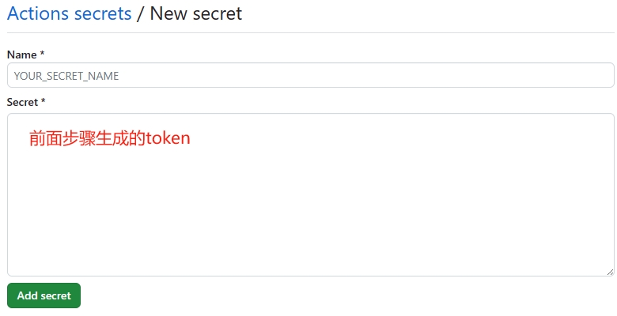
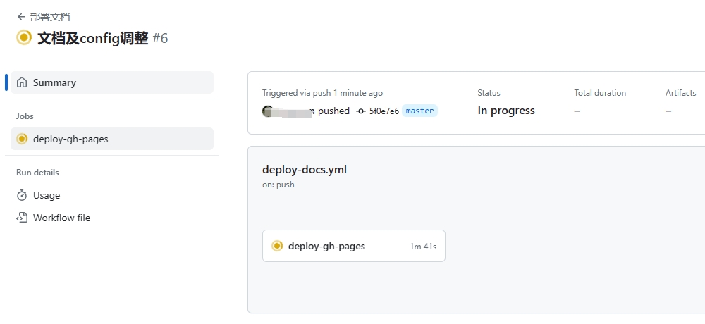
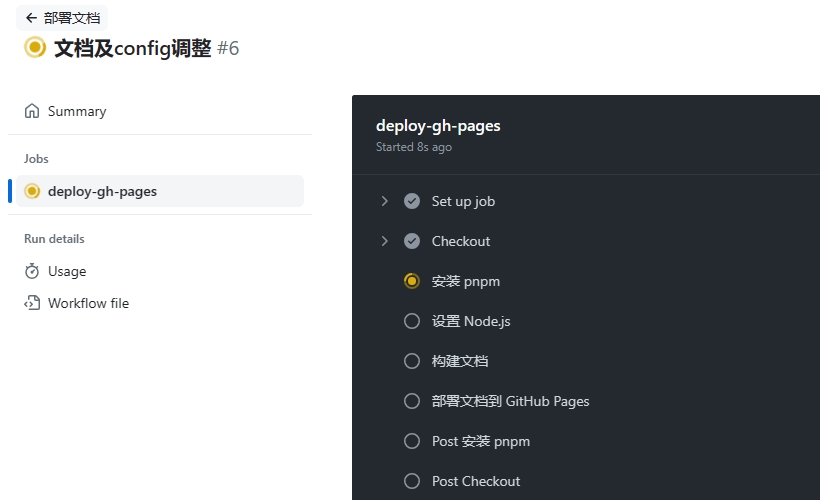
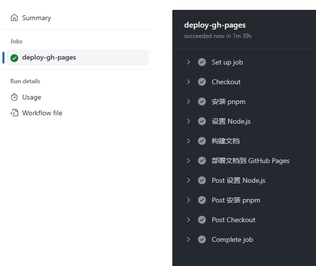

# 自动化部署 Github Pages

- 使用的是默认的构建输出目录 (.vuepress/dist)
- `config.ts` 里的 `base` 设置为 `/`
- 使用 `pnpm` 作为包管理器
- 部署后通过 `https://<username>.github.io/` 访问

## 在 `Github` 创建新 repository

此仓库对应 `vuepress` 的源码，项目名为 `<username>.github.io`

> 仓库必须设置为 `Pubilc`



## 创建 `ACCESS_TOKEN`

- 在 `github profile` 页面上依次点击 `Settings` → `Developer Settings` → `Personal access tokens` → `Tokens (classic)`
  
- 继续点击 `Generate new token` → `Generate new token (classic)`
  
- 点击 `Generate token` 后复制下 `token` 备用，页面刷新后得重新生成

## 配置仓库 `Security`

- 进入 `<username>.github.io` 仓库的 `Settings` 页面
- 点击 `Security` 下的 `Secrets and variables / Actions`
  
- 点击 `New repository secret`，`Name` 输入 `ACCESS_TOKEN`，`Secret` 黏贴前面复制好的 `token`
  
- 点击 `Add secret` 保存

## 配置 `deploy-docs.yml` 文件

在源码目录下创建 `.github/workflows/deploy-docs.yml` 文件来配置工作流

> `yml` 文件里的 `uses` 字段表示 workflow 的 action 范例文件，一般不需要改动

```yml
name: 部署文档

on:
  # 每当 push 到 master 分支时触发部署
  push:
    branches: [master]
  # 手动触发部署
  workflow_dispatch:

permissions:
  contents: write

jobs:
  deploy-gh-pages:
    # 服务器环境：最新版 Ubuntu
    runs-on: ubuntu-latest

    steps:
      # 拉取代码
      - name: Checkout
        uses: actions/checkout@v3
        with:
          # “最近更新时间” 等 git 日志相关信息，需要拉取全部提交记录
          fetch-depth: 0
          # 如果你文档需要 Git 子模块，取消注释下一行
          # submodules: true

      - name: 安装 pnpm
        uses: pnpm/action-setup@v2
        with:
          # 使用 pnpm 安装依赖
          run_install: true
          # 选择要使用的 pnpm 版本
          version: 8

      - name: 设置 Node.js
        uses: actions/setup-node@v3
        with:
          # 选择要使用的 node 版本
          node-version: 18
          # 缓存 pnpm 依赖
          cache: pnpm

      # 运行构建脚本
      - name: 构建文档
        env:
          NODE_OPTIONS: --max_old_space_size=8192
        run: pnpm run docs:build

      - name: 部署文档到 GitHub Pages
        uses: JamesIves/github-pages-deploy-action@v4
        with:
          # 部署到 gh-pages 分支，根据 master 构建后自动生成
          branch: gh-pages
          # 部署目录为 VuePress 的默认输出目录
          folder: src/.vuepress/dist
          # @see https://docs.github.com/cn/actions/reference/authentication-in-a-workflow#about-the-github_token-secret
          # secrets.ACCESS_TOKEN 要与配置仓库 `Security`步骤里的设置的 secret name 一致，比如前面 name 设置为 ci_token ，那这里就要改为 ${{ secrets.ci_token }}
          # 此选项默认为存储库范围的GitHub令牌
          token: ${{ secrets.ACCESS_TOKEN }}
```

## 查看 `Action` 执行情况

- 提交代码后进入 `<username>.github.io` 仓库的 `Action` 页面
  
- 点击 `Jobs` 下的 `deploy-gh-pages`
  
  
- 浏览器就能正常访问到 `https://<username>.github.io/`

## 参考文献

- [1] [vuepress-github-pages](https://v2.vuepress.vuejs.org/zh/guide/deployment.html#github-pages)
- [2] [自动令牌身份验证](https://docs.github.com/zh/actions/security-guides/automatic-token-authentication#about-the-github_token-secret)
